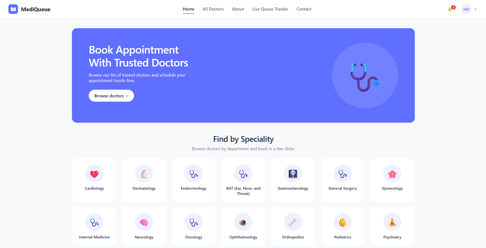
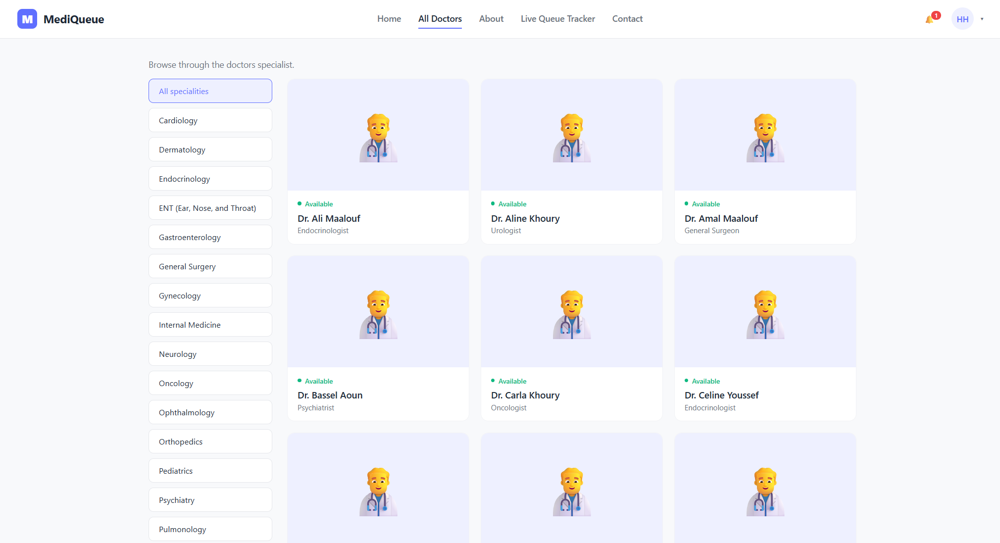
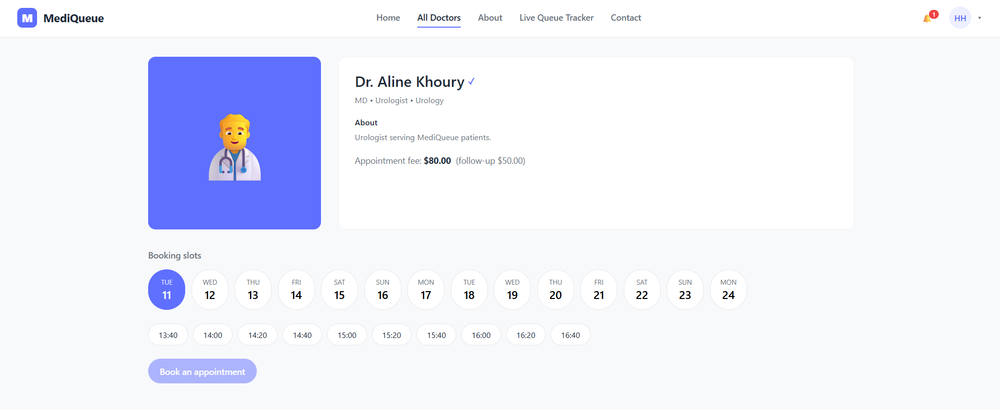
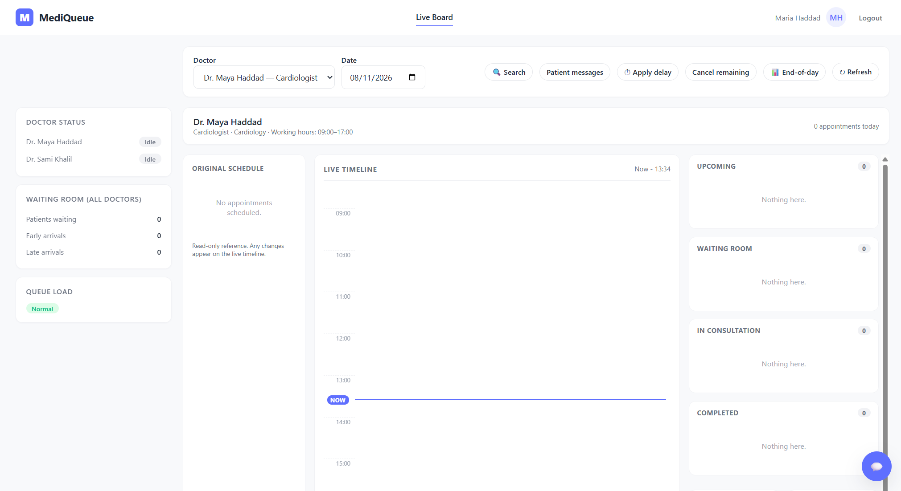

# MediQueue

MediQueue is a full-stack hospital appointment and live queue management system. It gives patients, reception staff, doctors, and administrators role-specific workflows while keeping queue changes synchronized in real time.

## Screenshots

### Patient home

Patients can browse the hospital's specialties and start an appointment booking.



### Doctor directory

The directory can be filtered by specialty and shows each doctor's availability.



### Doctor profile and booking

Patients can review a doctor's profile, select a date and time, and book an appointment.



### Staff live board

Reception staff can manage the day's appointments through an original schedule, a live timeline, waiting-room summaries, and queue status columns.



## Features

- Patient registration, authentication, doctor discovery, appointment booking, profile management, appointment history, payments, notifications, and live queue tracking
- Staff check-in and queue operations, timeline adjustments, delays, no-shows, cancellations, end-of-day summaries, patient messaging, and doctor chat
- Doctor dashboard, queue management, consultation records, schedules, unavailability, profile settings, and staff chat
- Admin overview and reporting plus department, doctor, and staff management
- JWT-based role authorization and optional SMTP password-reset emails
- Real-time board and chat updates with Socket.IO, with polling fallback for the live board
- PostgreSQL persistence, audit logs, collision-aware schedule updates, and seeded demo data

## Tech stack

- Frontend: React, React Router, Vite, Axios, Socket.IO Client
- Backend: Node.js, Express, PostgreSQL, `pg`, JWT, bcrypt, Nodemailer, Socket.IO
- Database tooling: PostgreSQL or pgAdmin

## Project structure

```text
.
|-- backend/
|   |-- scripts/          # base schema, migrations, and seed utilities
|   |-- src/              # API, services, middleware, and sockets
|-- docs/screenshots/     # README screenshots
|-- frontend/
    |-- src/              # React pages, components, API helpers, and styles
```

## Local setup

### Prerequisites

- Node.js 20.19 or newer (or Node.js 22.12+)
- PostgreSQL with permission to create extensions, tables, indexes, functions, and triggers
- pgAdmin or the `psql` command-line client

### 1. Create the database

Create an empty PostgreSQL database named `mediqueue_db`.

### 2. Apply the schema and migrations

In pgAdmin, open the Query Tool for `mediqueue_db` and run these files in order:

1. `backend/scripts/hospital_appointment_schema.sql`
2. `backend/scripts/staff_department_assignments.sql`
3. `backend/scripts/password_reset_schema.sql`
4. `backend/scripts/patient_staff_communication_schema.sql`
5. `backend/scripts/appointment_booking_rule_update.sql`

The same setup can be run with `psql` from the repository root:

```bash
psql -d mediqueue_db -f backend/scripts/hospital_appointment_schema.sql
psql -d mediqueue_db -f backend/scripts/staff_department_assignments.sql
psql -d mediqueue_db -f backend/scripts/password_reset_schema.sql
psql -d mediqueue_db -f backend/scripts/patient_staff_communication_schema.sql
psql -d mediqueue_db -f backend/scripts/appointment_booking_rule_update.sql
```

### 3. Configure the backend

```bash
cd backend
npm install
```

Copy `backend/.env.example` to `backend/.env`, then replace the placeholders with local values. At minimum, configure the PostgreSQL password and use a strong, private JWT secret.

```dotenv
PGHOST=localhost
PGPORT=5432
PGUSER=postgres
PGPASSWORD=your_local_postgres_password
PGDATABASE=mediqueue_db

PORT=5000
NODE_ENV=development
JWT_SECRET=replace_with_a_long_random_secret
JWT_EXPIRES_IN=12h
CLIENT_URL=http://localhost:5173
```

SMTP settings are optional for the rest of the application, but they are required for the password-reset email flow.

### 4. Seed demo data

From `backend`:

```bash
npm run seed
```

The seed creates 16 departments, 48 doctors, 32 staff accounts, and one admin account. Each department has three doctors and two staff members: one staff member is assigned to two doctors and the other is assigned to the remaining doctor. Database rules also ensure that staff can only handle doctors in their own department and can never be assigned more than two doctors.

The seed resets existing application data, so only run it against a development database.

Demo password for all seeded accounts: `Password123!`

- Example staff login: `maria@mediqueue.test`
- Admin: `admin@mediqueue.test`
- All remaining staff and doctor account emails, together with their assignments, are printed by the seed command

### 5. Run the backend

From `backend`:

```bash
npm run dev
```

The API starts at `http://localhost:5000`. A health check is available at `http://localhost:5000/api/health`.

### 6. Run the frontend

In a second terminal:

```bash
cd frontend
npm install
npm run dev
```

Open `http://localhost:5173`.

## Useful commands

```bash
# Backend
cd backend
npm run dev
npm start
npm run seed

# Frontend
cd frontend
npm run dev
npm run build
npm run preview
```

## Security and data notes

- Local credentials remain in `backend/.env` and are not tracked.
- The included payment interface is a demonstration flow, not a production payment integration.

## License

No license has been added yet. Until one is chosen, normal copyright restrictions apply.
